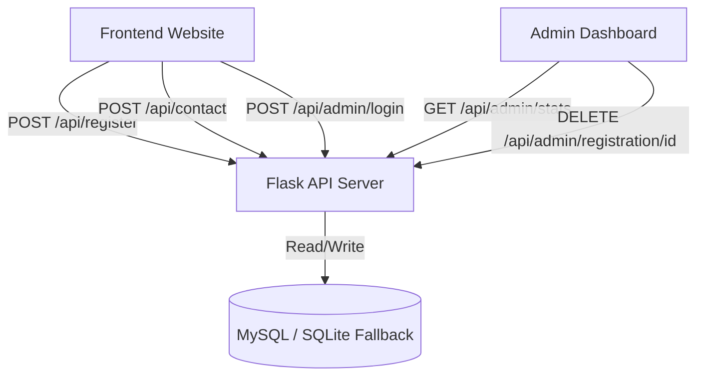

# Tech Innovation Summit 2025 — Full-Stack Event Landing Page & Management System

An interactive, responsive full-stack event hosting platform designed to showcase event details, speakers, schedules, and handle registrations and inquiries. The application integrates a modern frontend landing page with a robust Python Flask API and a dual database connection layer supporting both MySQL and SQLite.

## 🚀 Key Features

*   **Premium Glassmorphic Design**: Stunning light/dark theme aesthetics with floating animation orbs, mouse parallax particles, magnetic click effects, and 3D tilt speaker cards.
*   **Persistent Theme Sync**: System-wide theme settings synced across the landing page and the Admin Dashboard using `localStorage`.
*   **Secure Ticket Generator**: Form validation (Name, Email, Phone number verification) that calls the Flask API to generate and store unique attendee tickets (e.g., `TIS-8F3K9A`).
*   **Dual-Layer Database System**: Connects automatically to **MySQL** database server; falls back gracefully to a local **SQLite** database (`event_management.db`) if MySQL is not detected, ensuring instant out-of-the-box operation.
*   **Integrated Admin Portal**:
    *   Secure login gate (integrated directly into the navbar overlay modal).
    *   Real-time statistics dashboard (Attendee counts, registered events, inbox inquiries).
    *   Attendee search & filter table.
    *   Cancellation/Deletion actions with verification prompts.
    *   Organizer messages inbox for contact submissions.
*   **Portfolio-Safe Data**: Fully configured with safe placeholder inputs (`xyz@gmail.com` and `+91 943xxxxx` formatting) and mapped to Mohali, India location.

---

## 🛠️ Tech Stack

*   **Frontend**: HTML5, Vanilla CSS3 (Custom Variables, CSS Grids, Glassmorphism, animations), Javascript ES6.
*   **Backend**: Python, Flask, Flask-CORS.
*   **Database**: MySQL (production-ready) / SQLite (local development fallback).
*   **Libraries**: FontAwesome (icons), Google Fonts (Outfit, Inter), Animate On Scroll (AOS).

---

## 📐 System Architecture



---

## 🔧 Installation & Setup

### Prerequisites
*   Python 3.10 or higher
*   MySQL Server (Optional: if not running, the app automatically switches to SQLite)

### Step-by-Step Launch

1.  **Clone the Repository**:
    ```bash
    git clone https://github.com/yourusername/event-management-platform.git
    cd event-management-platform
    ```

2.  **Install Dependencies**:
    Initialize a virtual environment and install backend modules:
    ```bash
    # Create virtual environment
    python -m venv venv
    
    # Activate virtual environment (Windows)
    .\venv\Scripts\activate
    
    # Install required packages
    pip install -r requirements.txt
    ```

3.  **Configure Database (Optional)**:
    If you wish to use MySQL, rename `.env.example` to `.env` and fill in your credentials:
    ```ini
    DB_HOST=localhost
    DB_USER=root
    DB_PASSWORD=your_mysql_password
    DB_NAME=event_management
    ```
    Then, execute the table creation statements found inside `database.sql` in your SQL client.
    *(If you skip this step, the application will automatically write to a local `event_management.db` SQLite file).*

4.  **Start the Backend API Server**:
    ```bash
    python app.py
    ```
    The server will startup in debug mode listening on `http://127.0.0.1:5000`.

5.  **Run the Web Pages**:
    Open the files in your preferred browser:
    *   `index.html` — Landing Page (Submit registrations or contact requests)
    *   `admin.html` — Management Portal (Manage dashboard and statistics)

---

## 🔐 Admin Panel Credentials

*   **Username**: `admin`
*   **Password**: `TIS2025admin`

---

## 📝 License
Distributed under the MIT License. See `LICENSE` for more information.
#
